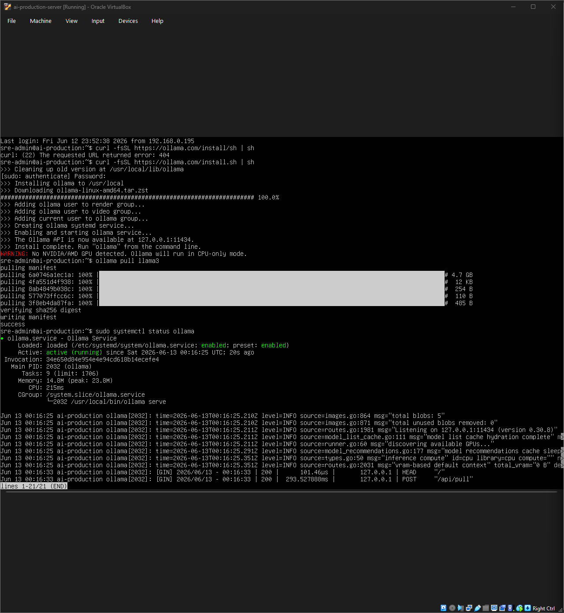
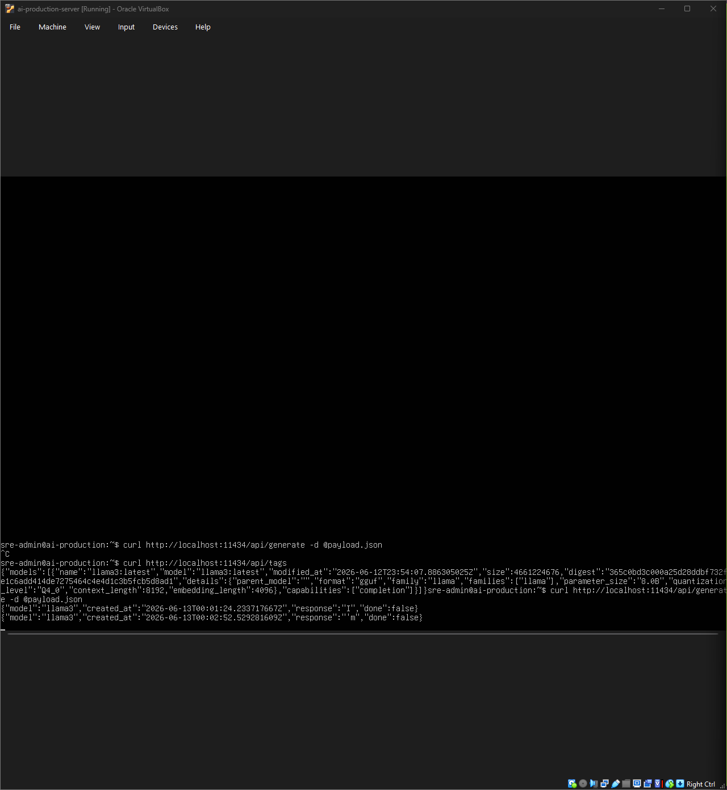
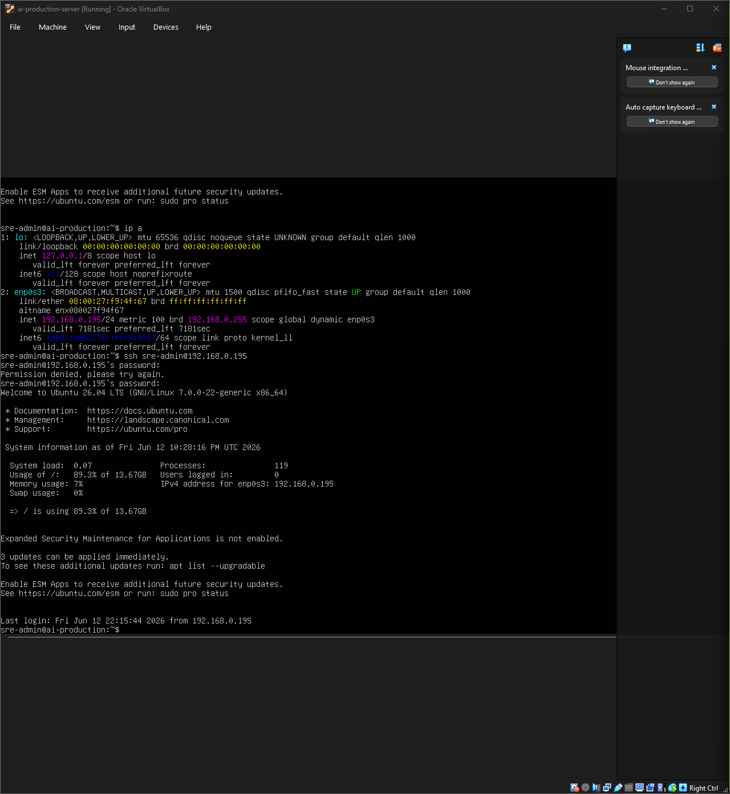

# Project 1: Zero-Trust AI Infrastructure & Enterprise Testbed

## Objective
To architect a fully private, self-hosted AI compute engine on an isolated Linux server node, establishing a zero-trust network boundary to process sensitive enterprise system telemetry without third-party API exposure.

## Scenario
The organization requires an autonomous incident response system to monitor production servers for security anomalies. 
Due to the highly sensitive nature of system access logs, sending telemetry to external cloud AI vendors violates corporate data sovereignty policies. 
A dedicated headless target server must be provisioned to serve as a secure, compliant sandbox for local LLM operations.

---

## 1. Internal Infrastructure Security Policy (Excerpt)
* **Infra-Pol-01 (Data Sovereignty):** All AI models processing internal system logs, network telemetry, or authentication records must be hosted on-premise. Third-party API transmission is strictly prohibited.
* **Infra-Pol-02 (Zero-Trust API Binding):** Internal AI compute engines must bind exclusively to the local loopback interface (`127.0.0.1`) to prevent external network enumeration.
* **Infra-Pol-03 (Headless Administration):** All production servers must restrict administrative access to encrypted SSH tunnels; graphical user interfaces (GUIs) are prohibited to minimize the attack surface.

---

## 2. The Compliance Crosswalk Matrix

| Internal Policy ID | Technical Implementation | Architecture Mapping | Validation Artifact |
| :--- | :--- | :--- | :--- |
| **Infra-Pol-01** | Local Ollama Engine & Llama 3 (8B) | **On-Premise Compute:** Eliminates external data transit. |  |
| **Infra-Pol-02** | Localhost Port Binding (11434) | **Zero-Trust Network:** Isolates API from external attackers. |  |
| **Infra-Pol-03** | OpenSSH Daemon (`sshd`) | **Remote Access:** Encrypted headless administration. |  |
---

## Summary
Infrastructure security requires absolute control over data paths. 
By deploying an open-source, local AI engine within an isolated network sandbox, I demonstrated the ability to balance modern automated reasoning with strict zero-trust parameters. 
Keeping the entire compute footprint on-premise satisfies internal data sovereignty policies, eliminates recurring API expenses, and establishes a secure, defensible foundation for autonomous incident response workflows.
