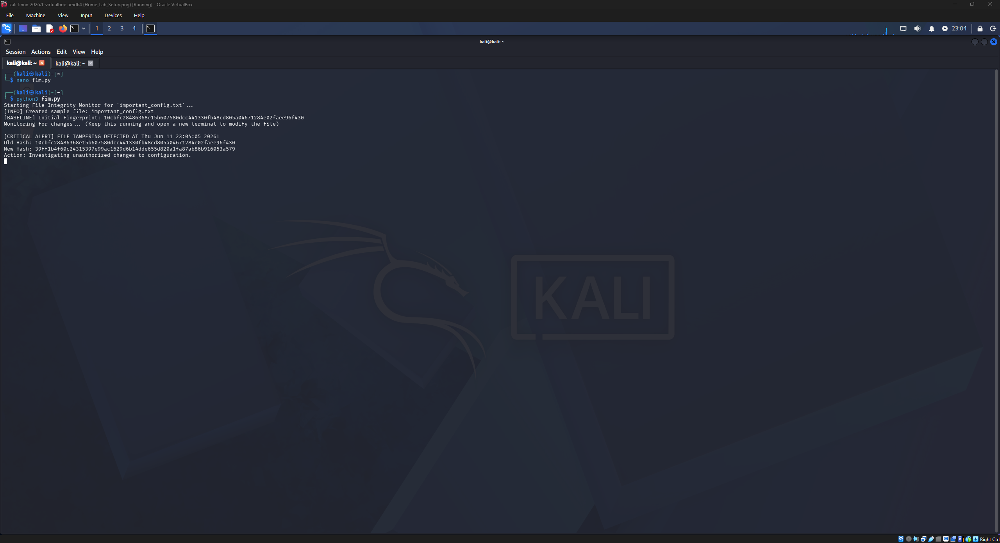

# Project 8: Python File Integrity Monitor (FIM)

## Objective
To build a custom File Integrity Monitor (FIM) using Python to detect unauthorized alterations to critical system files in real-time. 

## Skills Demonstrated
* **Python Programming:** Utilized the `hashlib`, `os`, and `time` libraries to create a continuous monitoring loop.
* **Cryptography:** Applied SHA-256 hashing algorithms to establish immutable baseline fingerprints for sensitive data.
* **Tamper Detection:** Automated the detection of unauthorized configuration changes, a core requirement of Zero Trust architecture.

## The Script in Action

## Analysis
In a production environment, unauthorized changes to configuration files are often the first indicator of a system compromise. 
By utilizing cryptographic hashing, this Python script acts as a digital tripwire, ensuring that any deviation from the baseline is immediately flagged for incident response triage.
