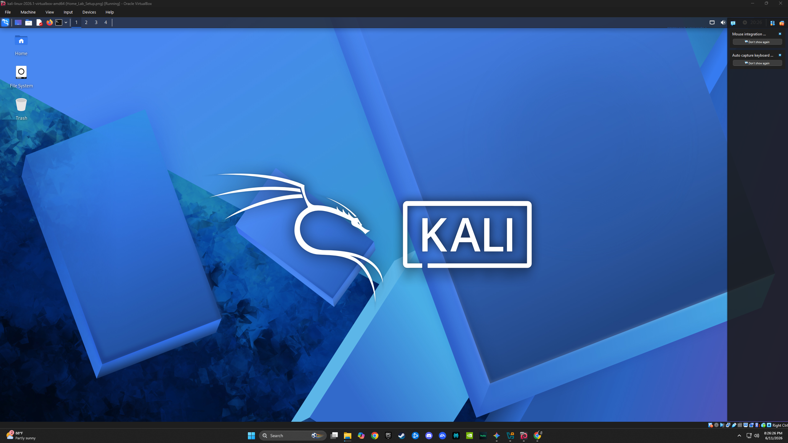
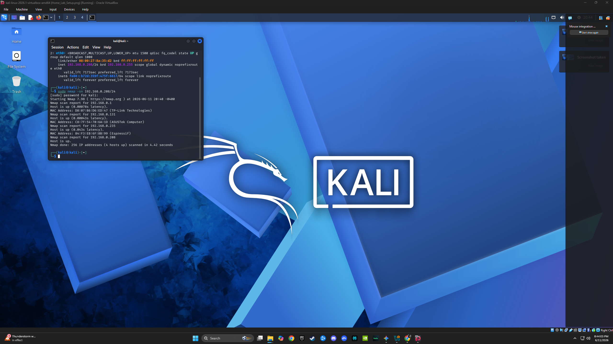

# Home Lab Projects

## Project 0: Kali Linux Virtual Machine Setup
This is the foundation of my security lab. I have configured a Kali Linux environment for penetration testing and security analysis.

Project 1: Home Network Security Audit
Objective: Perform a baseline audit of a home network to identify connected assets and verify network visibility.

Tools Used:
Virtualization: VirtualBox
OS: Kali Linux
Tool: Nmap (Network Mapper)

Methodology:
Configured Kali Linux VM with a Bridged Adapter to ensure direct network visibility.
Executed "sudo nmap -sn 192.168.x.x/24" to discover active hosts.
Mapped connected devices to identify potential assets.

Findings:

Total Devices Discovered: 4

Observation: I identified 4 devices. This scan confirms my visibility into the network, which is the foundational step for any incident response process.

Analysis
Effective security starts with knowing what you own. By performing this audit, I established a baseline for my home network. In a corporate environment, this process is known as "Asset Inventory Management", which is critical for ensuring only authorized devices access sensitive data. I know who is allowed on my network, any potential threats can be quikcky identified.
